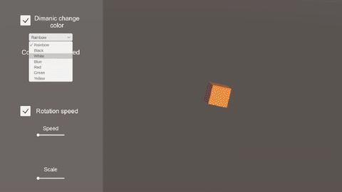
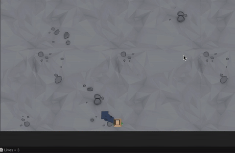

# 🎓 Unity Learn Junior Programmer — Extra Tasks

## UI Cube Controller (Unit 2.2)

This project was completed as part of an assignment to create a UI for controlling a 3D object. 
It includes toggles for rainbow mode and rotation, sliders for transparency, speed, and scale, and a dropdown menu to select a color. 
All UI elements are connected and interact through the `UIManager` script.

According to the second additional task, the project was published on Unity Play.

🔗 [View on Unity Play](https://play.unity.com/en/games/084bf0e1-facd-42ca-9e36-dc28fefe7246/thecube)

## HungryAnimals (Unit 2.1)
This is a basic top-down movement prototype created in Unity as part of a Unit 1 task. The character can move along the X and Y axes, with boundaries preventing them from leaving the defined area.

As part of the second additional task, the prototype was extended with animal spawning within movement limits, a hunger bar using a UI Slider in World Space, and simple console logging of score and lives.

## Driving Prototype (Unit 1.1)
This is a simple driving prototype made in Unity as part of a Unit 1 task. It includes basic vehicle movement, steering, and two camera modes: first-person and third-person.

According to the second additional task, the prototype was extended with oncoming traffic, a driving environment, and a camera switch system.
Local multiplayer can be implemented using custom input axes via Unity’s Input Manager (Edit/Project Settings/Input Manager), assigning different controls for each player (e.g., WASD for Player 1, Arrow keys for Player 2).

